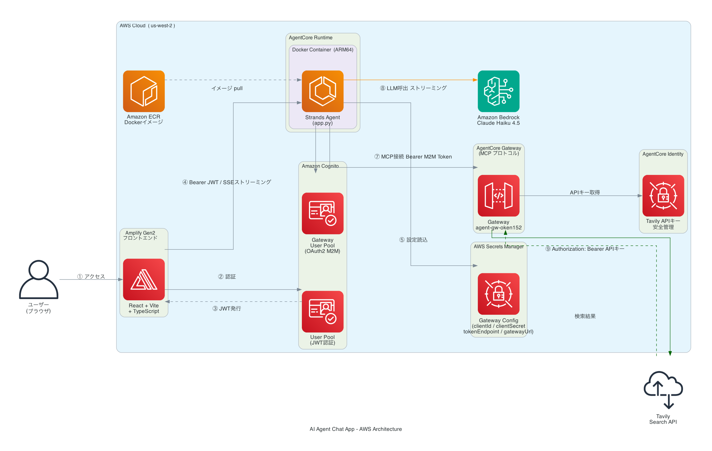

# 🤖 AI エージェントチャットアプリ（AgentCore + Amplify Gen2）

Amazon Bedrock AgentCore と AWS Amplify Gen2 を組み合わせた、**Web 検索機能付きフルスタック AI チャットアプリ**です。
Cognito 認証・ストリーミング応答・Tavily 外部検索ツール連携を実現しています。

---

## 📖 概要

このプロジェクトは以下の機能を持つ AI チャットアプリケーションです：

- 🔐 **メール/パスワード認証**（Amazon Cognito）
- 💬 **ストリーミング表示**（SSE）で AI の回答をリアルタイムに表示
- 🔍 **Tavily Web 検索ツール**を使って最新情報を調べて回答
- 📱 **レスポンシブ対応**のチャット UI
- ☁️ **GitHub push → 自動デプロイ**（Amplify CI/CD）

---

## 🏗️ アーキテクチャ構成図



### リクエストフロー詳細

| ステップ | 処理内容 |
|:---:|---|
| 1 | ユーザーがブラウザでアプリにアクセス |
| 2-3 | Cognito でメール/パスワード認証 → JWT トークン発行 |
| 4 | React がフロントエンドから AgentCore Runtime に SSE で接続（Bearer JWT） |
| 5 | Runtime の Strands Agent が Secrets Manager から Gateway 接続情報を取得 |
| 6 | OAuth2 client_credentials フローで M2M アクセストークンを取得 |
| 7 | MCP クライアントで AgentCore Gateway に接続、Tavily ツールを取得 |
| 8 | Strands Agent が Claude Haiku でユーザーの質問を処理 |
| 9 | 検索が必要な場合、Gateway 経由で Tavily API を呼び出し（Identity が API キー注入） |

---

## 🛠️ 使用技術

### フロントエンド
| 技術 | バージョン | 役割 |
|---|---|---|
| React | 18.3 | UI フレームワーク |
| Vite | 7.3 | ビルドツール |
| TypeScript | 5.9 | 型安全な開発 |
| AWS Amplify UI | 6.13 | 認証 UI コンポーネント |
| react-markdown | 9.0 | AI 応答の Markdown レンダリング |

### バックエンド（AWS CDK / Amplify Gen2）
| 技術 | 役割 |
|---|---|
| AWS Amplify Gen2 | インフラ定義・自動デプロイ |
| Amazon Cognito | ユーザー認証・M2M OAuth2 |
| AgentCore Runtime | エージェント実行環境（Docker コンテナ）|
| AgentCore Gateway | 外部 API の MCP プロトコル変換 |
| AgentCore Identity | 外部 API キーの安全な管理 |
| Amazon ECR | Docker イメージのホスティング |
| AWS Secrets Manager | 接続情報・API キーの保存 |

### エージェント（Python）
| ライブラリ | 役割 |
|---|---|
| `strands-agents` | マルチステップ AI エージェントフレームワーク |
| `bedrock-agentcore` | AgentCore Runtime との統合 |
| `mcp` | MCP プロトコルクライアント |
| `httpx` | OAuth2 トークン取得の HTTP クライアント |

### AI モデル
| モデル | 用途 |
|---|---|
| `us.anthropic.claude-haiku-4-5-20251001-v1:0` | チャット応答の生成 |

---

## 📁 ディレクトリ構成

```
agentcore-cdk/
├── amplify/                        # Amplify Gen2 バックエンド定義
│   ├── backend.ts                  # バックエンドのエントリポイント
│   ├── auth/
│   │   └── resource.ts             # Cognito 認証設定（メール認証）
│   └── agent/
│       ├── resource.ts             # CDK TypeScript（Runtime + Gateway + Identity）
│       ├── app.py                  # Strands Agent エントリポイント
│       ├── requirements.txt        # Python 依存パッケージ
│       ├── Dockerfile              # ARM64 対応 Docker イメージ
│       └── .dockerignore           # Docker ビルド除外ファイル
├── src/                            # React フロントエンド
│   ├── main.tsx                    # アプリエントリ（Authenticator でラップ）
│   ├── App.tsx                     # チャット UI + SSE ストリーミング
│   ├── index.css                   # チャット UI スタイル
│   └── App.css                     # 追加スタイル
├── amplify.yml                     # Amplify CI/CD ビルド設定
├── package.json                    # Node.js 依存パッケージ
└── vite.config.ts                  # Vite 設定
```

---

## ✅ 前提条件

| ツール | バージョン | 確認コマンド |
|---|---|---|
| Node.js | >= 20.20.0 | `node --version` |
| npm | >= 10.8.0 | `npm --version` |
| AWS CLI | v2 | `aws --version` |
| AWS アカウント | - | us-west-2 リージョンへのアクセス権 |
| GitHub アカウント | - | リポジトリの fork/clone 用 |

### 必要な AWS 権限
- Amazon Bedrock（Claude Haiku モデルへのアクセス）
- Amazon Cognito
- AgentCore Runtime / Gateway / Identity
- Amazon ECR
- AWS Secrets Manager
- AWS Lambda
- AWS IAM

> ⚠️ **Bedrock モデルアクセス**: us-west-2 リージョンで `anthropic.claude-haiku-4-5-20251001-v1:0` のモデルアクセスを有効化してください。
> [Amazon Bedrock コンソール](https://us-west-2.console.aws.amazon.com/bedrock/home?region=us-west-2#/modelaccess) → 「モデルアクセス」→ Claude Haiku を有効化

---

## 🚀 セットアップ手順

### 1. リポジトリのフォーク・クローン

```bash
# GitHub でリポジトリをフォーク後、クローン
git clone https://github.com/<あなたのユーザー名>/agentcore-cdk.git
cd agentcore-cdk
```

### 2. 依存パッケージのインストール

```bash
npm install
```

### 3. AWS 認証の設定

```bash
# AWS SSO ログイン（または通常の aws configure）
aws configure
# リージョンは us-west-2 を推奨
```

### 4. Amplify Gen2 と GitHub の接続（自動デプロイ設定）

1. [AWS Amplify コンソール](https://us-west-2.console.aws.amazon.com/amplify/home?region=us-west-2) にアクセス
2. 「新しいアプリを作成」→「Git プロバイダーを使用してデプロイ」
3. GitHub と接続してフォークしたリポジトリを選択
4. `main` ブランチを選択
5. ビルド設定は `amplify.yml` が自動検出されます
6. 「保存してデプロイ」をクリック

> 📌 初回デプロイには **10〜15 分程度**かかります（Docker イメージのビルドが含まれるため）

### 5. Tavily API キーの設定

現在のコードには Tavily の開発用 API キーが含まれています。本番環境では独自のキーを使用してください：

1. [Tavily](https://tavily.com/) でアカウントを作成して API キーを取得
2. [amplify/agent/resource.ts](amplify/agent/resource.ts) の先頭にある `TAVILY_API_KEY` を変更：

```typescript
const TAVILY_API_KEY = "tvly-your-api-key-here";
```

3. 変更をコミット・プッシュすると自動デプロイが開始されます

---

## 🔄 デプロイの仕組み

```
git push → GitHub → Amplify Console
                         ↓
                    amplify.yml に基づいてビルド
                         ↓
                    CDK で AWS リソースを自動作成
                    ・Cognito User Pool
                    ・AgentCore Runtime（ECRへDockerビルド＆プッシュ）
                    ・AgentCore Gateway + Identity
                    ・Secrets Manager シークレット
                         ↓
                    React アプリをビルド＆ホスティング
                         ↓
                    amplify_outputs.json に Runtime ARN を出力
                         ↓
                    デプロイ完了 → Amplify の URL でアクセス可能
```

---

## 🧪 動作確認

1. Amplify コンソールからデプロイ済みの URL にアクセス
2. 「アカウントを作成」でメールアドレスとパスワードを入力してサインアップ
3. 確認コードをメールで受け取り、入力してサインイン
4. チャット欄にメッセージを入力して送信：

**通常の質問**
```
こんにちは！自己紹介してください
```

**Web 検索が必要な質問**（Tavily 検索ツールが使われます）
```
最新のAWS Bedrockのニュースを教えてください
```
```
今日の東京の天気はどうですか？
```

> 🔧 Web 検索が実行されると、メッセージ欄に「`tavily-search___searchWeb` を実行中...」と表示されます

---

## ⚙️ ローカル開発

フロントエンドのみローカルで動作確認する場合：

```bash
# 1. Amplify の sandbox 環境を起動（AWS リソースを一時デプロイ）
npx ampx sandbox

# 2. 別ターミナルで React の開発サーバーを起動
npm run dev
```

> ⚠️ `ampx sandbox` は AgentCore Runtime・Gateway など全 AWS リソースをデプロイするため、
> 起動に 10〜15 分かかります。終了時は `Ctrl+C` → リソース削除の確認で `y`

---

## 🔧 よくあるトラブルと対処法

### ❌ デプロイが失敗する（`Name cannot be updated for an existing gateway`）

**原因**: AgentCore Gateway は CloudFormation のインプレース更新非対応です。

**対処**: `amplify/agent/resource.ts` の Gateway のロジカル ID を変更します：

```typescript
// "AgentGateway3" → "AgentGateway4" に変更（数字をインクリメントする）
const gateway = new agentcore.Gateway(stack, "AgentGateway4", {
  gatewayName: `agent-gw4-${envId}`,  // 名前も変更
  ...
});
```

---

### ❌ チャットで「検索に一時的なエラーが発生しました」が返る

**原因**: Gateway の IAM 権限が不足している可能性があります。

**確認方法**:
```bash
# Gateway に DEBUG モードを設定してエラー詳細を確認
aws bedrock-agentcore-control update-gateway \
  --gateway-identifier "<your-gateway-id>" \
  --name "<gateway-name>" \
  --role-arn "<role-arn>" \
  --protocol-type "MCP" \
  --protocol-configuration '{"mcp": {"supportedVersions": ["2025-03-26"]}}' \
  --authorizer-type "CUSTOM_JWT" \
  --authorizer-configuration '{"customJWTAuthorizer": {"discoveryUrl": "...", "allowedClients": ["..."]}}' \
  --exception-level "DEBUG" \
  --region us-west-2
```

---

### ❌ `amplify_outputs.json が見つかりません` エラー

**原因**: Amplify のバックエンドデプロイが完了していません。

**対処**: Amplify コンソールでデプロイが `SUCCEED` になるのを待ち、再度アクセスしてください。

---

### ❌ Docker ビルドが毎回走って遅い

**原因**: `amplify/agent/.dockerignore` が正しく設定されていない可能性があります。

**確認**: 以下のファイルが存在するか確認：

```
amplify/agent/.dockerignore
```

内容：
```
*.ts
*.js
node_modules/
__pycache__/
*.pyc
.env
```

---

## 📝 主要ファイルの説明

### [amplify/agent/resource.ts](amplify/agent/resource.ts)
CDK TypeScript で以下の AWS リソースを定義：
- **AgentCore Runtime**: Strands Agent を実行する Docker コンテナ環境
- **AgentCore Gateway**: Tavily API を MCP ツールとして提供するゲートウェイ
- **AgentCore Identity**: Tavily API キーを安全に管理
- **Cognito M2M**: Gateway へのアクセス認証用 OAuth2 クライアント
- **Secrets Manager**: Gateway 接続情報を保存

### [amplify/agent/app.py](amplify/agent/app.py)
Strands Agent の Python 実装：
```python
@app.entrypoint
async def invoke_agent(payload, context):
    # 1. Secrets Manager から Gateway 接続情報を取得
    # 2. OAuth2 で M2M トークンを取得
    # 3. MCP クライアントで Gateway に接続
    # 4. Strands Agent で Claude Haiku + Tavily ツールを実行
    # 5. ストリーミングレスポンスを返す
```

### [src/App.tsx](src/App.tsx)
React チャット UI の実装：
- Cognito JWT トークンを取得して AgentCore Runtime に送信
- SSE（Server-Sent Events）でストリーミングレスポンスを処理
- react-markdown で AI の応答を Markdown レンダリング

---

## 💰 コスト概算

| サービス | 費用の目安 |
|---|---|
| AgentCore Runtime | リクエスト数に応じた従量課金 |
| AgentCore Gateway | リクエスト数に応じた従量課金 |
| Amazon Bedrock (Claude Haiku) | 入力 $0.80 / 100万トークン、出力 $4.00 / 100万トークン |
| Amplify Hosting | 無料枠あり（月 5GB まで無料） |
| Amazon Cognito | 月 50,000 MAU まで無料 |
| Secrets Manager | シークレット 1 件 $0.40/月 |

> ⚠️ 開発・検証目的での利用を想定しています。大規模な本番運用の際はコスト設計をお願いします。

---

## 🔒 セキュリティ

- Tavily API キーはコード内にハードコードされています。本番環境では環境変数や Secrets Manager から動的に取得する実装を推奨します
- Cognito で認証されたユーザーのみが AgentCore Runtime にアクセスできます
- Runtime → Gateway 間の通信は OAuth2 M2M 認証で保護されています
- Gateway → Tavily 間の API キーは AgentCore Identity で安全に管理されています

セキュリティ上の問題を発見した場合は [CONTRIBUTING.md](CONTRIBUTING.md) をご確認ください。

---

## 📚 参考リンク

- [Amazon Bedrock AgentCore ドキュメント](https://docs.aws.amazon.com/bedrock-agentcore/)
- [AWS Amplify Gen2 ドキュメント](https://docs.amplify.aws/gen2/)
- [Strands Agents ドキュメント](https://strandsagents.com/docs/)
- [Tavily API ドキュメント](https://docs.tavily.com/)

---

## 📄 ライセンス

MIT-0 ライセンス。詳細は [LICENSE](LICENSE) ファイルを参照してください。
